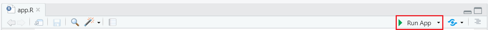

# Construction d’un plan d’aménagement

Dans cette section, nous verrons la marche à suivre pour créer un plan d’aménagement numérique. Ce plan sera sous forme d'une application web construite principalement à partir du langage de programmation R, du logiciel [Rstudio](https://rstudio.com/), un environnement de développement pour R, et de la bibliothèque logicielle ("Package") [Shiny](https://shiny.rstudio.com/). 

Avant de commencer la programmation, il faut avoir fait ou obtenu au préalable le découpage des peuplements forestiers du lot et leur description qui leur sont associés au format shapefile (shp.). Pour vous assister dans la création de votre première application Shiny, le code complet et les données nécessaires pour sa création sont disponibles sur [Github](https://github.com/florent1208/Plan_amenagement). 

Ci-dessous, vous trouverez plusieurs liens qui vous seront utiles pour la création de cette application :

* [Aide-mémoire Shiny](https://rstudio.com/wp-content/uploads/2015/08/shiny-french-cheatsheet.pdf)
* [Mastering Shiny](https://mastering-shiny.org/index.html)
* [Leaflet for R](https://rstudio.github.io/leaflet/)
* [DT: An R interface to the DataTables library](https://rstudio.github.io/DT/)
* [Shiny - Articles (rstudio.com)](https://shiny.rstudio.com/articles/)


## Étapes Préliminaires

1.	Installez la bibliothèque Shiny.

```{r,eval=FALSE}
install.packages("shiny")
```

2.	Créez un fichier Shiny.

```{r,fig.cap="Appuyez sur Shiny Web App", echo=FALSE}

```

  
3.	Dans la boite de dialogue, inscrire le nom de l’application et choisir un dossier ou serons enregistré les fichiers et appuyez sur créer.

```{r,fig.cap="Boite de dialogue pour créer une nouvelle application Shiny.", echo=FALSE}

```

4.	Dans votre script app.R ainsi créé, effacez ce qui y est déjà inscrit et construisez le squelette de l’application.

```{r,eval=FALSE}
library(shiny) 
ui <- fluidPage(
  
) 
server <- function(input, output){
  
} 
shinyApp(ui, server)

```

Ces lignes de code sont à la base de toute application Shiny.  

•	`Ui`  : Pour "user interface", définis la page web HTML dans laquelle l’utilisateur va interagir.    
•	`Server` : définis les instructions pour construire les objets et le comportement de l’application.  
•	`shinyApp(ui, server)` : Permets de combiner l'interface `ui` et les instructions `server` pour créer l'application web.  

À cette étape, si tout fonctionne normalement, en cliquant sur le bouton **Run App** (figure \@ref(fig:run-app)),  vous devriez voir une page vide apparaitre. 

```{r run-app,fig.cap="Le bouton Run App se retrouve en haut à droite de la fenêtre du script.", echo=FALSE}

```


5.	Dans le dossier créé à l’étape 3, créez un dossier appelé "data" et copiez-y les fichiers .SHP du découpage des peuplements forestiers. Toutes les données nécessaires à la création de votre application doivent être dans ce dossier.  

```{r,fig.cap="Contenu de votre dossier après l'étape 5", echo=FALSE}

```


6.	Dans votre script app.R, ajoutez les bibliothèques qui vous seront utiles pour créer cette application. Si ces bibliothèques ne sont pas déjà installées, veuillez les installer de la même façon que nous avons installé Shiny à l’étape 1.

```{r,eval=FALSE}
library(sf) # pour manipuler des données géospatiales
library(leaflet) # pour créer des cartes interactives
library(leaflet.extras)
library(tidyverse) # pour faciliter la programmation (opérateur "%>%")
library(DT) # pour créer des tableaux interactifs
```
7.	Importez le fichier de découpage des peuplements dans R et changez le système de coordonnée géographique pour l’utiliser avec Leaflet.  

```{r,eval=FALSE}
st_read("le_nom_de_votre_fichier.shp") -> peup_for 
if (!st_crs(peup_for)$epsg %in% c(4326)) st_transform(peup_for, 4326) -> peup_for
```

## Programmation des objets qui seront affiché dans l’interface

Ici, nous allons donner les instructions à R pour générer la carte interactive et la table des peuplements. Dans Shiny, les objets créés dans la section server, doivent être nommés de la façon suivante :

```{r,eval=FALSE}
server <- function(input, output){
  
  Output$text <-renderPrint ({print("Hello, world!")})
  
}
```
Dans l’exemple ci-dessus, `output$text` indique que nous donnons les instructions pour programmer l’objet que nous avons nommé `text`.La fonction `renderPrint` va envelopper le code qui sera inscrit entre les parenthèses. Les fonctions `render{Type}` sont spécifique à l’objet que nous voulons créer. Pour la carte, nous utiliserons `renderLeaflet({})` et pour la table, `renderDataTable({})`.


### La carte interactive

Pour créer la carte interactive, nous utiliserons le "package" [Leaflet](https://rstudio.github.io/leaflet/).  

1.	Dans la section server de votre script, entre les accolades, créez l’objet "carte".

```{r,eval=FALSE}
server <- function(input, output){
  
  output$carte <- renderLeaflet({leaflet() %>%
  
})
```

2.	En dessous de la  ligne `output$carte <- renderLeaflet({leaflet() %>%`, ajoutez le découpage des peuplements forestier et définir la symbologie.
```{r,eval=FALSE}
      
      addPolygons(data = peup_for,
                  weight = 1.5,
                  opacity = 2,
                  fillOpacity = 0,
                  options = pathOptions(pane = "Peup"),
                  layerId = peup_for$No_Peup,
                  group = "Peuplement forestier")%>%
```

3.	Ajoutez les images satellitaires fournies par Esri.

```{r,eval=FALSE}
addProviderTiles('Esri.WorldImagery', group = "Satellite")%>%
```
4.	Ajoutez le modèle numérique de terrain (MNT) à partir du service [WMS du Ministère des forêts, faunes et parcs (MFFP)](http://www.igouverte.org/documentation/services-web-ogc-igo/).

```{r,eval=FALSE}
addWMSTiles("https://geoegl.msp.gouv.qc.ca/ws/mffpecofor.fcgi?", 
            layers = "lidar_ombre", 
            options = WMSTileOptions(format = "image/png", transparent = TRUE),group = "Relief")%>%
```
5.	Ajoutez le modèle hauteur de canopée (MHC) du MFFP.

```{r,eval=FALSE}
addWMSTiles("https://geoegl.msp.gouv.qc.ca/ws/mffpecofor.fcgi?", 
            layers = "lidar_mhc", 
            options = WMSTileOptions(format = "image/png", transparent = TRUE),
            group = "Hauteur de canopée")%>%
```

6.	Ajoutez la légende pour le MHC.

```{r,eval=FALSE}
addWMSLegend(position = "bottomright", "https://geoegl.msp.gouv.qc.ca/ws/mffpecofor.fcgi?version=1.3.0&service=WMS&request=GetLegendGraphic&sld_version=1.1.0&layer=lidar_mhc&format=image/png&STYLE=default", 
            layerId = "Hauteur de canopée")%>%
```

7.	Ajoutez les contrôles de la carte.

```{r,eval=FALSE}

addLayersControl(overlayGroups = c("Peuplement forestier"),
                 baseGroups= c("Satellite","Hauteur de canopée","Relief"),
                 options = layersControlOptions(collapsed = TRUE))%>%
```

8.	Ajoutez la barre d’échelle

```{r,eval=FALSE}
addScaleBar(position = "bottomleft")

})
```

### La table des peuplements

Pour créer le tableau interactif, nous utiliserons la "pakage" [DT](https://rstudio.github.io/DT/).

1.	Créez un nouveau tableau de données ("data frame") à partir du tableau de données "peup_for" et manipulez les données en vue d’intégrer ces données dans le tableau. À cette étape, il est nécessaire de supprimer la géométrie pour afficher les données dans un tableau.  

```{r,eval=FALSE}
peup_for%>%
  st_drop_geometry %>% #supprime la géométrie
  subset(select= -OBJECTID)%>% #supprime les champs inutiles
  mutate(sup_ha= round(sup_ha,2))%>% # arrondit le champ "sup_ha"
  arrange(No_Peup)->info # Ordonne le tableau en ordre croissant en fonction du champ "No_Peup"
```

2.	Créez l’objet `tableau`

```{r,eval=FALSE}
  output$tableau<- renderDataTable({
    datatable(info,
              colnames = c("# Peuplement", "Affectation", "Groupement d'essence", "Classe de densité", "Classe de hauteur", "Classe d'âge", "Type de couvert", "Travaux suggérés","Échéancier","Superficie (ha)"),
              rownames = FALSE,
              options = list(
                pageLength = 10,
                stateSave=TRUE),
              selection = 'single')})
```

## Programmation des interactions entre la carte et la table des peuplements

Avec Shiny, il est possible de programmer des interactions entre plusieurs objets d’une même application. Pour bien comprendre les étapes suivantes, veuillez vous référer aux site web suivant :

* [Chapter 4 Basic reactivity | Mastering Shiny](https://mastering-shiny.org/basic-reactivity.html)
* [Reactivity - An overview](https://shiny.rstudio.com/articles/reactivity-overview.html)
* [How to understand reactivity in R](https://shiny.rstudio.com/articles/understanding-reactivity.html)

Avec les lignes de codes qui vous seront présentés ci-dessous, lorsque l’utilisateur cliquera sur un peuplement de la carte, ce peuplement sera mis en évidence et la ligne correspondant à celui-ci dans le tableau sera elle aussi mise en évidence. Il sera aussi possible de sélectionner une ligne dans le tableau pour mettre en évidence le peuplement correspondant.

1.	Avec la fonction `reactive`, nous allons enregistrer dans la variable num_peup, le numéro de la ligne du tableau qui est sélectionnée. Le numéro de la ligne du tableau doit correspondre au numéro de peuplement. C’est pour cette raison que nous avons ordonné les numéros de peuplements en ordre croissant à l’étape 1 de la section \@ref(la-table-des-peuplements).

```{r,eval=FALSE}
  num_peup <- reactive({
    info$No_Peup[input$tableau_rows_selected]})
```

2.  Les prochaines lignes de code vont nous permettre de dessiner par-dessus le peuplement sélectionné, soit dans la carte ou dans la table, le même polygone, mais de couleur rouge. Pour ce faire, nous utiliserons la fonction `observe` et une clause `if` pour y arriver. La fonction `leafletProxy()` permet de mettre à jour la carte.

```{r,eval=FALSE}
  observe({
    if(!is.null(num_peup())){
      observeEvent(input$tableau_rows_selected,
                   {num_peup = input$tableau_rows_selected
                   peup_surling<- subset(peup_for,peup_for$No_Peup==num_peup)

                   leafletProxy('map')%>%
                     removeShape("highlighted_polygon") %>%
                     addPolygons(data = peup_surling,
                                 weight = 3,
                                 opacity = 100,
                                 fillOpacity = 0,
                                 color = "red",
                                 layerId = "highlighted_polygon")

                   })}
    else{leafletProxy("map") %>%
        removeShape("highlighted_polygon")
    }})

```

3.	Pour que le polygone rouge apparaisse par-dessus les autres polygones, nous devons ajouter deux commandes dans les instruction de la carte en dessous de la ligne `output$map <- renderLeaflet({leaflet() %>%`.

```{r,eval=FALSE}
      addMapPane("highlighted_polygon",zIndex = 410)%>% # Augmente l'altitude du polygone rouge
      addMapPane("Peup",zIndex = 300)%>% # 
```

4. Enfin, nous voulons que la rangée du tableau correspondant au peuplement sélectionné dans la carte soit mise en évidence. Pour faire cela, nous utiliserons la fonction `observeEvent` pour que lorsqu’un peuplement est sélectionné, son identifiant soit enregistré dans la variable `clickid`. Cette variable sera utilisée dans la fonction `dataTableProxy` pour mettre à jour le tableau avec la rangée surlignée et à la bonne page.
    
```{r,eval=FALSE}
 observeEvent( input$map_shape_click, { 
  clickid<-input$map_shape_click$id
  dataTableProxy("tableau") %>%
    selectRows(which(input$tableau_rows_all == clickid)) %>% # Sélectionne la rangée
    selectPage(which(input$tableau_rows_all == clickid) %/%  # Sélectionne la page
                 input$tableau_state$length + 1)})
```

## Programation de l'interface

Dans cette section nous verrons comment programmer la disposition des objets que nous avons créée dans l’interface. Pour ce faire, toutes les commandes que nous aborderons ci-dessous doivent être inscrites dans la section ui de notre script. Dans notre exemple, nous utiliserons la fonction fluidRow pour placer la carte au-dessus du tableau. Pour bien comprendre comment les interfaces sont programmées avec Shiny, consultez la page web suivante :

* [Shiny - Application layout guide (rstudio.com)](https://shiny.rstudio.com/articles/layout-guide.html)
* [Chapter 3 Basic UI | Mastering Shiny](https://mastering-shiny.org/basic-ui.html)

1.	Entre les parenthèses de la fonction `ui <- fluidPage()`, inscrire les lignes de codes suivantes :

```{r,eval=FALSE}
# La carte dams la première rangée
  fluidRow(column(width=8, # Largeur de la carte
                  offset= 2, # Décalage de la carte par aux bordures
                  h2("Carte du lot"), #Titre
                  leafletOutput(outputId = "carte", # Nom de l'objet qui a créé du côté serveur
                                height = 600))), # Hauteur de l'objet
# Le tableau dans la deuxième rangée
  fluidRow(column(width=10,
                  offset= 1,
                  dataTableOutput(outputId = "tableau")))
```

2. Testez l'aplication en appuyant sur le bouton Run App (figure \@ref(fig:run-app))
